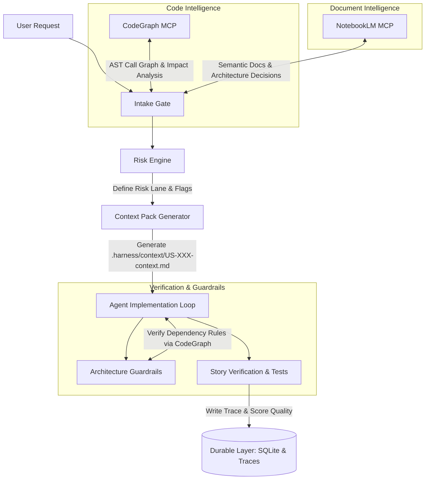

# Harness Intelligence OS (HI-OS)
## Technical Specification & Design Document

HI-OS transforms the static `repository-harness` framework into an active **operating system for AI coding agents**. Instead of relying on manual instructions and human classification, HI-OS uses codebase structural graphs (via CodeGraph) and semantic documentation indexes (via NotebookLM) to coordinate, govern, and verify agent operations.

---

## 1. Core Vision

> **"CodeGraph understands where the code is affected; NotebookLM understands what the product requirements and decisions say; Harness governs what the agent is allowed to do and how it must prove its work."**

By wrapping these three layers, HI-OS acts as a **smart checkpoint** between the user prompt and the actual code edits, ensuring that every AI agent works inside a bounded, safe, and fully audited sandbox.



---

## 2. Architecture & Coordination Options

To integrate the three tools, we can choose between two coordination patterns:

### Option A: Agent-Coordinated (Lightweight & Native)
The AI agent (e.g. Claude Code, Cursor, AntiGravity) coordinates the tool calls. The `harness-cli` provides commands that accept outputs from CodeGraph and NotebookLM.
*   **Pros:** Very simple to implement, no need for the Rust CLI to build complex JSON-RPC clients or handle auth credentials.
*   **Cons:** Relies on the agent following instructions precisely.

### Option B: CLI-Centric (Autonomous & Centralized)
The `harness-cli` acts as an MCP client. It directly launches and communicates with the CodeGraph and NotebookLM MCP servers.
*   **Pros:** Enforces guardrails at the tool level; the human can run `harness-cli intake --auto` and get the same results regardless of which IDE/Agent is used.
*   **Cons:** Higher complexity; Rust CLI needs to manage Node.js processes (`npx`) and browser sessions for NotebookLM auth.

> [!TIP]
> For the MVP, **Option A (Agent-Coordinated)** is highly recommended. The Agent performs the queries to CodeGraph and NotebookLM, and feeds the formatted reports into the `harness-cli` to produce the final Context Pack.

---

## 3. Core Modules (MVP Scope)

### Module 1: `harness-cli intake --auto`
Runs impact analysis and retrieves context to generate a structured risk assessment before any code is modified.

*   **Input parameters:**
    *   `--summary <text>`: The user's request.
    *   `--impact-report <path>`: A JSON output generated by querying CodeGraph (containing list of affected symbols, callers/callees, and files).
    *   `--business-context <path>`: A markdown snippet generated by NotebookLM summarizing relevant business rules.
*   **Logic:**
    1.  Parse the `--impact-report`. If any affected file matches paths like `src/auth/*`, `db/migrations/*`, or API endpoints $\rightarrow$ Automatically set risk flags (`Auth`, `Data Model`, `API Contract`).
    2.  Calculate the risk lane based on flags (e.g., $\ge 4$ flags or hard gates = `high_risk`).
    3.  Save the intake record to the SQLite database.
*   **Output:** Generates `.harness/context/risk-report.json`.

---

### Module 2: `harness-cli context pack --story <id>`
Aggregates the intake report, relevant decisions, design constraints, and tests into a single markdown file for the agent.

*   **Output Path:** `.harness/context/US-XXX-context.md`
*   **Contents:**
    ```markdown
    # Context Pack for US-XXX: [Story Title]
    
    ## 1. Scope of Work
    *   **User Request:** [Summary]
    *   **Target Files to Modify:**
        *   [File A](file:///absolute/path/to/FileA) (CodeGraph Impact: High)
        *   [File B](file:///absolute/path/to/FileB) (CodeGraph Impact: Medium)
    
    ## 2. Risk Lane: [Normal / High-Risk]
    *   **Risk Flags:** Auth, Data Model
    
    ## 3. Grounded Business Rules (NotebookLM)
    *   [Constraint 1]
    *   [Constraint 2]
    
    ## 4. Architecture Constraints (docs/ARCHITECTURE.md)
    *   No domain layer dependencies on infrastructure.
    *   Parse-First Boundary Rule applies to input DTOs.
    
    ## 5. Verification Requirements
    *   Must verify using: `cargo test`
    *   Required proofs: Unit (Yes), Integration (Yes)
    ```

> [!IMPORTANT]
> The Context Pack is the agent's absolute boundary. By reading **only** the Context Pack, the agent avoids reading unrelated parts of the repository, saving up to 80% of the token context budget and preventing hallucinations.

---

## 4. Extended Modules (Post-MVP)

### Module 3: `harness-cli arch-check`
A static analysis command that queries CodeGraph's symbol relationship graph.
*   **Function:** Checks for architectural violations.
*   **Example Rule:** If CodeGraph returns a path where a file inside `src/domain/` imports a symbol defined in `src/infrastructure/`, the CLI prints:
    ```text
    Architecture Violation:
    'src/domain/user.rs' imports 'src/infrastructure/db.rs'
    Reason: Domain layer must not depend on Infrastructure.
    ```
*   **Action:** Fails the verification gate.

---

### Module 4: `harness-cli story verify <id>`
A comprehensive verification command before close. It asserts:
- [x] Story exists in `harness.db`.
- [x] Risk lane constraints are met.
- [x] Unit/Integration proofs are marked as `1` (numeric true).
- [x] Trace is recorded and has trace quality $\ge$ required tier.
- [x] `arch-check` passes with no violations.

---

## 5. Database Schema Extensions

To support HI-OS, the existing `scripts/schema/` SQLite schema will be extended with a migration `003-hi-os.sql`:

```sql
-- Migration 003: Harness Intelligence OS additions

-- Extends intake with impact data from CodeGraph
ALTER TABLE intake ADD COLUMN code_impact_summary TEXT; -- JSON representation of affected components
ALTER TABLE intake ADD COLUMN grounded_context TEXT;      -- Semantic summary from NotebookLM

-- Extends story with context pack references
ALTER TABLE story ADD COLUMN context_pack_path TEXT;
ALTER TABLE story ADD COLUMN arch_check_result TEXT 
    CHECK(arch_check_result IN ('pass','fail') OR arch_check_result IS NULL);
```

---

## 6. Directory Structure

When fully installed, the project directory layout will incorporate the `.harness` folder:

```text
project/
  AGENTS.md
  README.md
  harness.db             <-- SQLite database (ignored)
  .harness/              <-- HI-OS Operational Sandbox
    context/
      risk-report.json   <-- Current generated risk assessment
      codegraph-impact.json
      notebooklm-brief.md
      US-001-context.md  <-- Generated context pack for Story US-001
    traces/
      US-001-trace.md
  docs/
    HARNESS.md
    FEATURE_INTAKE.md
    ARCHITECTURE.md
    TEST_MATRIX.md
    decisions/
    stories/
    templates/
  scripts/
    bin/
      harness-cli.exe    <-- Compiled Rust CLI
    schema/
      001-init.sql
      002-story-verify.sql
      003-hi-os.sql      <-- New migration
```

---

## 7. Next Steps for Implementation

1.  **Define JSON Schemas:** Create schemas for `codegraph-impact.json` and `risk-report.json` to ensure clean parsing contracts.
2.  **Extend Rust CLI:** Add `intake --auto` and `context pack` CLI commands in `crates/harness-cli/src/interface.rs` and `application.rs`.
3.  **Draft Agent Instructions:** Update `AGENTS.md` and `docs/CONTEXT_RULES.md` to instruct agents on how to run CodeGraph impact queries and NotebookLM searches to feed the HI-OS engine.
